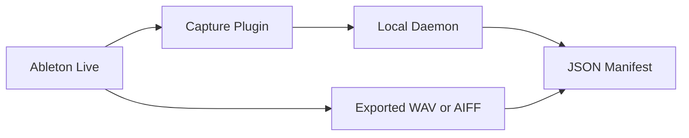

# Architecture

## Purpose

Define the high-level architecture for the Ableton audio provenance proof of concept.

The system captures observable provenance events from routed audio workflows and serializes selected evidence into a C2PA-compatible crJSON manifest.

## Core Principle

Never claim full Ableton provenance.

The system only reports what it can:
- observe
- hash
- timestamp
- classify
- verify

Everything else must remain:
- unknown
- unobserved
- inferred
- user declared

## Minimal Architecture

## System Components

### Ableton Live

The host DAW.

The POC does not attempt full DAW introspection.

## Capture Plugin

A JUCE-based VST3 plugin.

Responsibilities:
- pass-through audio
- observe routed audio buffers
- optionally observe MIDI
- timestamp events
- compute hashes or fingerprints
- generate session and stem identifiers
- stream events to the daemon

The plugin is the trust boundary for observable provenance.

## Local Daemon

A macOS background process.

Responsibilities:
- receive UDP events
- persist session state
- monitor export folders
- detect exported WAV or AIFF files
- hash final exports
- generate internal provenance records
- serialize minimal C2PA-compatible manifests

## Internal Provenance Record

The internal provenance record is the primary truth model.

It stores:
- observed hashes
- timestamps
- source categories
- proof levels
- export relationships
- unknown or bypassed states

This internal model is richer than the exported C2PA manifest.

## C2PA/crJSON Export Layer

The system exports a simplified C2PA-compatible crJSON manifest.

The export layer maps:
- observed stems
- hashes
- actions
- ingredients
- source types

into C2PA-compatible assertions.

## Trust Boundary

The system can only verify what passes through the capture plugin.

Observable examples:
- audio buffers
- exported files
- timestamps
- routed MIDI events

Non-observable examples:
- hidden plugin state
- internal preset logic
- bypassed routing
- DAW internals
- unverifiable upstream provenance

## Source Categories

Initial categories:
- audio interface recording
- MIDI driving VST synth
- imported sample
- generator
- resampling
- manual import

## Proof Level Model

Every provenance claim should be classified as:
- directly_observed
- inferred
- user_declared
- externally_verified
- unknown_unobserved

## v0 Scope

The first implementation supports:
- one observed stem
- one exported asset
- one manifest

The goal is proving truthful observable provenance capture.

Not full production-ready C2PA implementation.

## Future Expansion

Future versions may support:
- multiple stems
- wrapper or mini-host plugin architecture
- plugin hosting inside the capture plugin
- richer ingredient relationships
- full C2PA signing workflows
- embedded manifests
- additional DAW support
