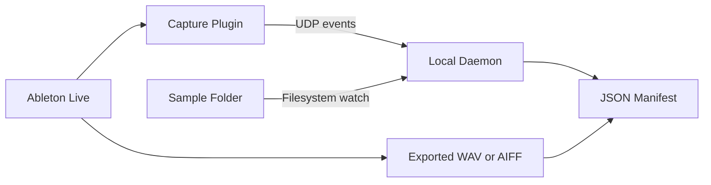

# Architecture

## Purpose

Define the high-level architecture for the Ableton audio provenance proof of concept.

The system captures observable provenance events from routed audio workflows and serializes selected evidence into a C2PA-compatible crJSON manifest.

## Core Principle

Never claim full Ableton provenance.

The system only reports what it can:
- observe
- hash
- timestamp
- classify
- verify

Everything else must remain:
- unknown
- unobserved
- inferred
- user declared

## Minimal Architecture

## System Components

### Ableton Live

The host DAW.

The POC does not attempt full DAW introspection.

## Capture Plugin

A JUCE-based VST3 plugin.

Responsibilities:
- pass-through audio
- observe routed audio buffers
- optionally observe MIDI
- timestamp events
- compute hashes or fingerprints
- generate session and stem identifiers
- stream events to the daemon

The plugin is the trust boundary for observable provenance.

### Granular Observation Pipeline

The plugin runs a background observation thread that consumes audio from a
lock-free ring buffer and produces the following per-window evidence:

1. **Rolling SHA-256 hash chain** -- each window hash includes the previous
   hash, creating a tamper-evident sequence.
2. **RMS level** -- energy measure used for silence detection and correlation.
3. **Zero-crossing rate** -- simple spectral proxy for correlation.
4. **Spectral centroid** -- FFT-derived frequency centre of mass; shifts above
   a threshold emit dedicated events.
5. **Silence/audio transition events** -- emitted when the window crosses the
   silence threshold in either direction.
6. **Transport state tracking** -- play/stop/record/loop/BPM changes observed
   via the JUCE play head.
7. **MIDI event capture** -- note on/off, CC, program change events forwarded
   through the plugin.

All events are serialized as single-line JSON and streamed to the daemon over
UDP (default port 9876).

## Local Daemon

A macOS background process.

Responsibilities:
- receive UDP events
- persist session state
- monitor export folders
- monitor configured sample import folders
- detect exported WAV or AIFF files
- detect imported sample files where the filesystem watcher can observe them
- hash final exports
- hash observed sample files
- generate internal provenance records
- serialize minimal C2PA-compatible manifests

### Evidence Receiver

Listens for UDP packets from the plugin, validates each event against the
taxonomy, timestamps receipt, and appends to a JSONL evidence file.

### Sample Correlation

When the sample watcher detects a new audio file it computes an audio
fingerprint (RMS + zero-crossing rate from the first second of PCM).  The
correlator compares incoming stream features against registered sample
fingerprints.  Matches produce ``ingredient_correlation`` events with proof
level ``inferred``.

## Event Taxonomy

| Event Type              | Proof Level        | Source    |
|-------------------------|--------------------|-----------|
| `buffer_hash`           | directly_observed  | plugin    |
| `audio_transition`      | directly_observed  | plugin    |
| `spectral_shift`        | directly_observed  | plugin    |
| `transport_change`      | directly_observed  | plugin    |
| `midi_event`            | directly_observed  | plugin    |
| `session_config_change` | directly_observed  | plugin    |
| `sample_file_observed`  | directly_observed  | daemon    |
| `ingredient_correlation`| inferred           | daemon    |

## Internal Provenance Record

The internal provenance record is the primary truth model.

It stores:
- observed hashes
- timestamps
- source categories
- proof levels
- export relationships
- filesystem-observed sample import events
- unknown or bypassed states

This internal model is richer than the exported C2PA manifest.

## C2PA/crJSON Export Layer

The system exports a simplified C2PA-compatible crJSON manifest.

The export layer maps:
- observed stems
- hashes
- actions
- ingredients
- source types

into C2PA-compatible assertions.

## Trust Boundary

The system can only verify what passes through the capture plugin.

Observable examples:
- audio buffers
- exported files
- sample files detected in configured watch folders
- timestamps
- routed MIDI events

Non-observable examples:
- hidden plugin state
- internal preset logic
- bypassed routing
- DAW internals
- exact Ableton track placement for a filesystem-observed sample
- unverifiable upstream provenance

## Source Categories

Initial categories:
- audio interface recording
- MIDI driving VST synth
- imported sample
- generator
- resampling
- manual import

## Proof Level Model

Every provenance claim should be classified as:
- directly_observed
- inferred
- user_declared
- externally_verified
- unknown_unobserved

## v0 Scope

The first implementation supports:
- one observed stem
- one exported asset
- one manifest

The goal is proving truthful observable provenance capture.

Not full production-ready C2PA implementation.

## Future Expansion

Future versions may support:
- multiple stems
- wrapper or mini-host plugin architecture
- plugin hosting inside the capture plugin
- richer ingredient relationships
- full C2PA signing workflows
- embedded manifests
- additional DAW support
