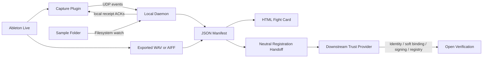

# Architecture

## Purpose

Define the high-level architecture for the Ableton audio provenance proof of concept.

The system captures observable provenance events from routed audio workflows and serializes selected evidence into a JSON fight-card manifest and a real, signed C2PA claim.

## Core Principle

Never claim full Ableton provenance.

The system only reports what it can:
- observe
- hash
- timestamp
- classify
- verify

Everything else must remain:
- unknown
- unobserved
- inferred
- user declared

## Minimal Architecture

```mermaid
flowchart LR
    A[Ableton Live] --> B[Capture Plugin]
    B -->|UDP events| C[Local Daemon]
    C -->|local receipt ACKs| B
    A --> D[Exported WAV or AIFF]
    C --> E[JSON Manifest]
    E --> G[HTML Fight Card]
    D --> E
    F[Sample Folder] -->|Filesystem watch| C
    E --> H[Neutral Registration Handoff]
    H --> I[Downstream Trust Provider]
    I -->|Identity / soft binding / signing / registry| J[Open Verification]
```

## System Components

### Ableton Live

The host DAW.

The POC does not attempt full DAW introspection.

## Capture Plugin

A JUCE-based VST3 plugin.

Responsibilities:
- pass-through audio
- observe routed audio buffers
- optionally observe MIDI
- timestamp events
- compute hashes or fingerprints
- generate session and stem identifiers
- stream events to the daemon

The plugin is the trust boundary for observable provenance.

### Granular Observation Pipeline

The plugin runs a background observation thread that consumes audio from a
lock-free ring buffer and produces the following per-window evidence:

1. **Rolling SHA-256 hash chain** -- each window hash includes the previous
   hash, creating a tamper-evident sequence.
2. **RMS level** -- energy measure used for silence detection and correlation.
3. **Zero-crossing rate** -- simple spectral proxy for correlation.
4. **Spectral centroid** -- FFT-derived frequency centre of mass; shifts above
   a threshold emit dedicated events.
5. **Silence/audio transition events** -- emitted when the window crosses the
   silence threshold in either direction.
6. **Transport state tracking** -- play/stop/record/loop/BPM changes observed
   via the JUCE play head.
7. **MIDI event capture** -- note on/off, CC, program change events forwarded
   through the plugin.

All events are serialized as single-line JSON and streamed to the daemon over
UDP (default port 9876). The socket is bound to an ephemeral loopback port, so
the daemon can return a scoped operational acknowledgement to the packet source.

Each plug-in lifecycle has a `plugin_instance_id` and
`plugin_capture_session_id`. Every prepared event has an increasing sequence.
The plug-in reports buffers/samples submitted, windows hashed, FIFO loss,
events prepared, UDP writes attempted/failed, and previously processed ACK
counters. A dedicated plug-in thread receives and parses acknowledgements. It
checks both `plugin_instance_id` and `plugin_capture_session_id`, detects daemon
instance changes, ignores session mismatches, and exposes fresh, stale, rejected,
gap, chain-break, or unknown receipt health to the UI.

The audio callback does not perform networking, JSON encoding, allocation,
locking, file access, or acknowledgement work. It only updates atomics and writes
preallocated audio/MIDI FIFOs; observation, serialization, UDP emission, and ACK
processing occur on background threads.

## Local Daemon

A macOS background process.

Responsibilities:
- receive UDP events
- persist session state
- monitor export folders
- monitor configured sample import folders
- detect exported WAV or AIFF files
- detect imported sample files where the filesystem watcher can observe them
- hash final exports
- hash observed sample files
- generate internal provenance records
- serialize proof-labelled JSON manifests and derived HTML fight cards

### Evidence Receiver

Listens for UDP packets from the plugin, validates each event against the
taxonomy, timestamps receipt, and appends to a JSONL evidence file.

After validation and persistence, the receiver sends `apw-local-udp-ack-v1` to
the packet source. The ACK identifies the daemon capture session, daemon
instance, plug-in instance, plug-in capture session, current event sequence,
highest accepted sequence, highest contiguous sequence, gaps, rejections, and
chain breaks. State is scoped by plug-in instance plus plug-in capture session,
so multiple instances do not share continuity. A new daemon seeing a sequence
above one reports the unknown prior prefix as a gap. Duplicates/out-of-order
packets are rejected and acknowledged as rejected.

This is local operational evidence only. The daemon directly observes ACK
dispatch, but cannot observe whether every ACK reached or was processed by the
plug-in. It is not identity proof, remote attestation, registry confirmation, or
cryptographic proof that the DAW was trustworthy.

Correlation uses only `daemon_received_monotonic_ms` or an equivalent daemon
monotonic timestamp. The original plug-in monotonic or filesystem/epoch source
timestamp is preserved separately. Buffers are limited by both age and count;
inferred matches are keyed by the events that actually contributed, so one
source event cannot repeatedly emit the same match.

All JSONL files rotate at 64 MiB with three backups. Rotation and drops produce
concise diagnostics. Manifest binding records a byte length and streaming
SHA-256 for each immutable prefix; neither generation nor verification loads an
entire evidence file into memory.

### Sample Correlation

When the sample watcher detects a new audio file it computes an audio
fingerprint (RMS + zero-crossing rate from the first second of PCM).  The
correlator compares incoming stream features against registered sample
fingerprints.  Matches produce ``ingredient_correlation`` events with proof
level ``inferred``.

### Routed Audio / Export Association

For the one-stem demo, each accepted routed `buffer_hash` contributes relative
RMS, zero-crossing, crest-factor, and four-part energy-envelope features. These
are compact observations, not raw audio. The daemon streaming-extracts equivalent
PCM WAV/AIFF features, normalizes fixed gain, searches a bounded set of time
offsets, and reports method/version, confidence, routed and matched coverage,
offset, comparable/matched window counts, and limitations. Sample-rate differences
are handled by matching window duration; channel data is mixed to mono.
Unsupported/compressed formats, inadequate duration, or low confidence return
`unavailable` or `not_established`.

The relationship always remains `inferred`. It is neither a watermark nor a
registry fingerprint, and failure is not proof of absence.

### Observation Coverage

Coverage is derived conservatively:

- `complete_observed_path`: plug-in counters are present, every hashed window
  was received, and no FIFO drop, UDP failure, sequence gap, out-of-order event,
  chain break, or daemon ACK dispatch failure was reported;
- `partial_observed_path`: routed evidence exists but counters show or cannot
  exclude loss;
- `unknown_coverage`: routed evidence or required counters are absent.

Coverage is a derived (`inferred`) result backed by directly observed counters.
Unknown coverage remains `unknown_unobserved`.

## Event Taxonomy

| Event Type              | Proof Level        | Source    |
|-------------------------|--------------------|-----------|
| `buffer_hash`           | directly_observed  | plugin    |
| `audio_transition`      | directly_observed  | plugin    |
| `spectral_shift`        | directly_observed  | plugin    |
| `transport_change`      | directly_observed  | plugin    |
| `midi_event`            | directly_observed  | plugin    |
| `session_config_change` | directly_observed  | plugin    |
| `host_environment`      | directly_observed  | plugin    |
| `sample_file_observed`  | directly_observed  | daemon    |
| `ingredient_correlation`| inferred           | daemon    |

## Ableton Semantic Bridge Research

A Max for Live / Live API bridge may be used as a research-only session metadata probe.

Responsibilities:
- inspect tracks, clips, selected track, devices, and exposed parameters where Live API allows it
- test whether audio clip file paths are exposed
- report limitations and proof levels

This bridge does not replace the capture plugin trust boundary and must not claim full DAW provenance.

## Internal Provenance Record

The internal provenance record is the primary truth model.

It stores:
- observed hashes
- timestamps
- source categories
- proof levels
- export relationships
- filesystem-observed sample import events
- unknown or bypassed states

This internal model is richer than the signed C2PA claim.

## C2PA Layer

`daemon/c2pa_engine` builds and signs a real C2PA claim with the c2pa-rs SDK
(`c2pa-python`). For a 16-bit PCM WAV the manifest is embedded as a top-level
`C2PA` RIFF chunk in a signed copy under `manifests/artifacts/`; AIFF cannot
embed, so it gets a `.c2pa` sidecar whose binding has no exclusions. The
detected export is never rewritten, because its digest is already committed.

`daemon/provenance` is the neutral seam that supplies the signing material.
`detect_provider()` returns a file-backed local reference provider by default
and is injected into the daemon the way the hardware attestation provider is,
so tests substitute their own. The chain it issues is self-signed by a root this
machine generated: key possession, never verified identity.

The claim carries:
- a `c2pa.actions.v2` assertion
- an `apw.unobserved` assertion naming what was not observed
- ingredients for the observed stem (`componentOf`), observed samples
  (`inputTo`), and project-referenced samples the daemon never observed
  (`inputTo`, `unknown_unobserved`, hash recorded)

`c2pa_mapping` remains in the manifest as a descriptive projection. The local
HMAC seal is a separate, local-only integrity mechanism and is not a C2PA
signature.

## Demo Presentation Layer

Each detected export produces two adjacent files:

- `<export>_manifest.json`: the evidence record used for verification;
- `<export>_provenance.html`: a dependency-free fight card derived from that JSON.

The HTML is presentation only. It adds no claims and is regenerated from the
manifest.

Each clean launcher run creates `demo-output/sessions/<capture-session>/` with
independent evidence, export, manifest, dashboard, and status paths. Repeated
exports of one filename use deterministic `_v002`, `_v003`, and later artifact
suffixes. A live, dependency-free dashboard shows observed/emitted/received/
ACK-issued states, scoped identifiers, counters, gaps, trust boundary, proof
legend, and artifact links.

Each completed export also produces:

- `artifacts/<export>_bundle_index.json`: canonical Ed25519-signed index of all
  payload members and hashes;
- `artifacts/<export>_evidence_bundle.zip`: deterministic archive containing the
  index, export, manifest, fight card, verifier result, handoff, and exactly the
  evidence prefixes bound by the manifest.

ZIP entry order, timestamps, and modes are deterministic. The signed index is
the archive trust root and therefore does not hash itself; it explicitly
enumerates every other archive member.

## Portable Integrity

The operational manifest has two deliberately separate integrity paths:

- Ed25519 signs deterministic `apw-json-sort-v1` content and embeds the raw
  public key. Verification needs no secret. The key is self-generated, so its
  signer identity is `unknown_unobserved`.
- The legacy local HMAC is retained for same-machine compatibility. It requires
  the secret key and provides no portable identity or hardware attestation.
- The bundle index uses the same self-generated Ed25519 demo key. Its signature
  proves index integrity and key possession, not externally verified identity.

`docs/manifest.schema.json` is the interchange schema. The verifier also
enforces proof-level, association, and complete-coverage invariants.

## Downstream Registration Handoff

Every operational manifest and adjacent handoff record carry the export hard
hash, routed chain commitment, coverage, inferred association, creator
declarations, self-generated signing key scope, evidence locations/hashes, and
a summary of the signed C2PA claim. Missing downstream requirements explicitly
include verified identity, author-controlled credentials, a production
certificate chain issued by a recognised authority, publication on a recognised
C2PA trust list, audio-native soft binding, resilient recovery, registry
publication, and consent/rights verification.

This is a neutral provenance handoff. The internal SDK adapter must validate and map it before it
becomes a registry record.

## Trust Boundary

The system can only verify what passes through the capture plugin.

Observable examples:
- audio buffers
- exported files
- sample files detected in configured watch folders
- timestamps
- routed MIDI events

Non-observable examples:
- hidden plugin state
- internal preset logic
- bypassed routing
- DAW internals
- exact Ableton track placement for a filesystem-observed sample
- unverifiable upstream provenance

## Source Categories

Initial categories:
- audio interface recording
- MIDI driving VST synth
- imported sample
- generator
- resampling
- manual import

## Proof Level Model

Every provenance claim should be classified as:
- directly_observed
- inferred
- user_declared
- externally_verified
- unknown_unobserved

## v0 Scope

The first implementation supports:
- one observed stem
- one exported asset
- one manifest
- one derived HTML fight card

The goal is proving truthful observable provenance capture.

The C2PA claim is real: the reference tool `c2patool 0.26.68`, run outside our
pipeline, reads the embedded WAV claim as `validation_state: Trusted` with zero
failures against the issuing root and `signingCredential.untrusted` without it
(`docs/VALIDATION.md`). It shares the c2pa-rs core with the binding that wrote
the claim, the AIFF sidecar path is not externally validated, and the chain is
self-issued, so this is not a production trust deployment.

## Future Expansion

Future versions may support:
- multiple stems
- wrapper or mini-host plugin architecture
- plugin hosting inside the capture plugin
- richer ingredient relationships
- CAWG identity assertions embedded in the signed claim
- signing under an externally issued certificate chain
- additional DAW support
